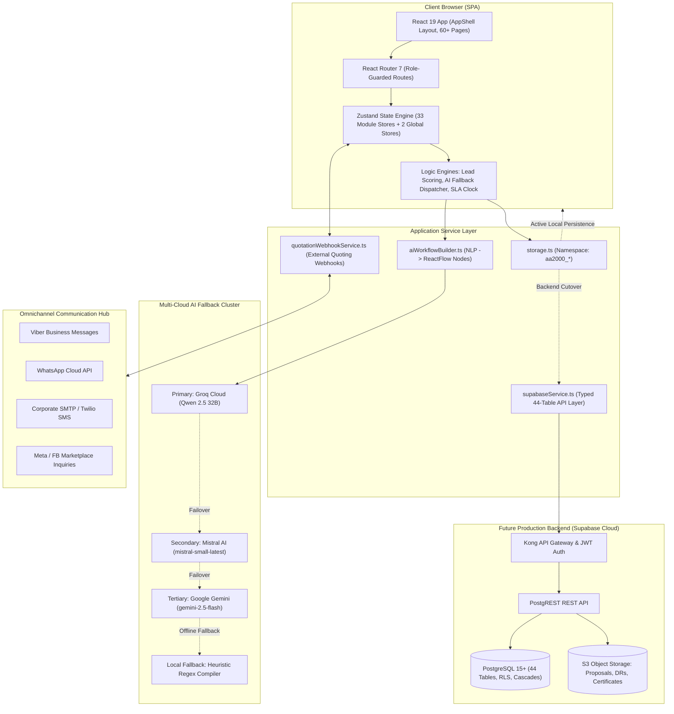
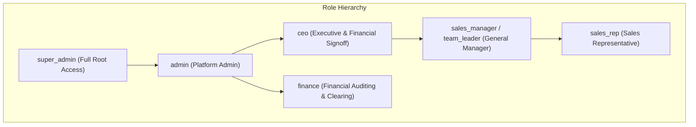
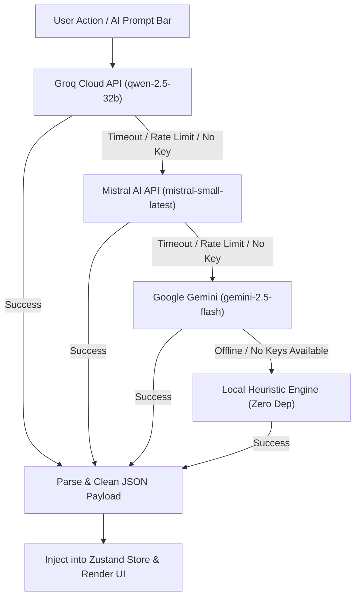

# AA2000 Connect CRM — Master Architecture Guide

Enterprise Architecture Specification for **AA2000 Security & Technology Solutions Inc.** — commercial CCTV surveillance, fire detection & alarm systems (FDAS), biometric access control, network infrastructure, and public safety systems in the Philippines.

---

## 📚 Technical Documentation Suite

This guide provides the architectural overview. Detailed deep-dive specifications are located in the [`docs/`](./docs) directory:

| Document | Description | Format |
|---|---|---|
| 📄 **[Entity Relationship Diagram (ERD)](./docs/ERD.md)** | Full schema of 44+ tables, data dictionary, keys, constraints, and cascades | Mermaid `erDiagram` + Data Tables |
| 📄 **[User Stories & Acceptance Criteria](./docs/USER_STORIES.md)** | 10 Epics, 7 Personas (CEO, GM, Sales Rep, Finance, Ops, Admin, Client) | Given / When / Then (Gherkin) |
| 📄 **[Data Flow Diagrams (DFD)](./docs/DATAFLOW_DIAGRAMS.md)** | Level 0 Context, Level 1 Decomposition, Level 2 Transactional Sequences | Mermaid `flowchart` + `sequenceDiagram` |
| 📄 **[System Architecture Blueprint](./docs/SYSTEM_ARCHITECTURE.md)** | Layered runtime, state stores, Multi-Cloud AI cascade, RBAC, deployment | Mermaid `flowchart` + Topology |
| 📄 **[State Transitions & Workflows](./docs/STATE_TRANSITIONS.md)** | Finite state machines for Deals, 4-Tier Incentives, Service Tickets, Bids | Mermaid `stateDiagram-v2` |

---

## 1. System Technology Stack

| Layer | Technology | Version | Purpose & Rationale |
|---|---|---|---|
| **Frontend Framework** | React | 19.x | Concurrent rendering, latest hooks & compiler support |
| **Language** | TypeScript | 6.x | Strict enterprise typing across all stores & API schemas |
| **Build & Bundler** | Vite | 8.x | Sub-second HMR dev server & optimized Rollup/Rolldown production builds |
| **Routing** | React Router | 7.x | Nested layouts, dynamic route guards, parameterized URL routing |
| **State Management** | Zustand | 5.x | Unopinionated, lightweight stores with zero boilerplate & synchronous reactivity |
| **Visual Node Builder** | @xyflow/react | React Flow | Visual canvas for drag-and-drop workflow automations |
| **Drag & Drop** | @dnd-kit | core/sortable | Accessible drag-and-drop Kanban pipeline boards |
| **Animations** | Framer Motion | 12.x | High-end micro-interactions, modal overlays, page transitions |
| **Styling** | Tailwind CSS | 3.x | Enterprise design system, utility tokens, glassmorphism |
| **Charts & Analytics** | Recharts | 2.x | Responsive SVG charts for revenue velocity, pipeline and KPI targets |
| **Icons** | Lucide React | Latest | Clean, consistent SVG icon set |
| **HTTP Client** | Axios | 1.x | Configured for third-party webhooks and API communications |
| **Date Manipulation** | date-fns | 4.x | Localized date formatting, SLA timer countdowns, and recurrence calculations |
| **Multi-Cloud AI** | Groq / Mistral / Gemini | Cloud APIs | Three-tier fallback pipeline for next-best actions and NLP workflow generation |
| **Persistence (Active)** | localStorage | Native Web API | Offline-capable browser storage (`aa2000_*` namespace via `storage.ts`) |
| **Database (Ready)** | Supabase PostgreSQL | 15+ | 44 relational tables, Row-Level Security, foreign key cascades, JSONB schemas |

---

## 2. High-Level System Architecture



---

## 3. Project Directory Map

```
c:\Users\Admin\Documents\Apps by Uno\AA2000 Connect (CRM)\
├── docs/                        # Complete technical architecture documentation suite
│   ├── ERD.md                   # 44-table Entity Relationship Diagram & Data Dictionary
│   ├── USER_STORIES.md          # Comprehensive User Stories & Acceptance Criteria
│   ├── DATAFLOW_DIAGRAMS.md     # Level 0, 1, and 2 Data Flow Diagrams
│   ├── SYSTEM_ARCHITECTURE.md   # Layered Architecture, Component Blueprint & RBAC
│   └── STATE_TRANSITIONS.md     # Lifecycle State Machines (Deals, Incentives, Tickets, Bids)
├── src/
│   ├── App.tsx                  # Root routing configuration, 60+ routes, QueryProvider
│   ├── main.tsx                 # Entrypoint (StrictMode > BrowserRouter > App)
│   ├── index.css                # Tailwind directives, custom glassmorphism, brand buttons
│   ├── components/
│   │   ├── layout/
│   │   │   ├── AppShell.tsx     # Fixed w-64 Sidebar + Navbar + Content Outlet
│   │   │   ├── Sidebar.tsx      # 10 role-gated navigation groups, 50+ items
│   │   │   └── Navbar.tsx       # Global search, notification bell, user profile
│   │   ├── auth/
│   │   │   └── ProtectedRoute.tsx # Auth interceptor & role-based route guard
│   │   └── ui/
│   │       └── AnimatedPage.tsx # Framer Motion wrapper components
│   ├── pages/                   # 60+ page components in 47 functional directories
│   │   ├── auth/                # LoginPage with 6 demo role accounts
│   │   ├── dashboard/           # DashboardPage (KPI counters, revenue velocity chart, AI scan)
│   │   ├── crm/                 # ContactsListPage, ContactDetailPage, CompaniesListPage
│   │   ├── pipelines/           # PipelineBoardPage (dnd-kit Kanban), DealDetailPage
│   │   ├── leads/               # LeadsPage, LeadDetailPage, LeadAssignmentPage
│   │   ├── incentives/          # IncentivesPage, IncentiveApprovalsPage (GM 7-Item), Finance, Exec
│   │   ├── requests/            # RequestsPage (Service Desk & Warranty Ticketing)
│   │   ├── sla/                 # SLAPage (Response & Resolution policies, Breach Monitor)
│   │   ├── automation/          # WorkflowBuilderPage (@xyflow/react NLP builder), WorkflowListPage
│   │   ├── marketing/           # EmailCampaignsPage, AIAutomationsPage, SocialPlannerPage
│   │   ├── comms/               # UnifiedInboxPage (Omnichannel messaging center)
│   │   ├── ai-agents/           # AIAgentsPage (4 deployed bots, Dynamic AI Model Switcher)
│   │   ├── ai-recommendations/  # AIRecommendationsPage (Multi-Cloud AI Next-Best-Steps)
│   │   ├── bidding/             # BiddingPage (PhilGEPS RA 9184 compliance checklists)
│   │   ├── kpi/                 # KPIPage (12 metrics, sales rep performance scorecards)
│   │   ├── product-search/      # ProductSearchPage (Local catalog + Live Google Grounding)
│   │   ├── knowledge-base/      # KnowledgeBasePage (Engineering SOPs + Live Google Search)
│   │   ├── policy-center/       # PolicyCenterPage (Company policies, DPA, Fire codes)
│   │   ├── service/             # ServiceManagementPage (PMS & CMS Maintenance contracts)
│   │   ├── marketplace/         # MarketplacePage (Facebook Marketplace listings & sync)
│   │   ├── projects/            # ProjectsPage (Project delivery, tasks, installation Gantt)
│   │   ├── admin/               # AdminPanelPage (Users, IT keys, Read-only integrations)
│   │   ├── audit-logs/          # AuditLogsPage (Immutable system audit trail)
│   │   └── settings/            # SettingsPage (Branding, profile, notifications)
│   ├── stores/                  # State management
│   │   ├── authStore.ts         # User authentication state (6 demo personas + super_admin)
│   │   ├── sidebarStore.ts      # Persistent sidebar configuration
│   │   └── modules/             # 33 isolated Zustand domain stores
│   ├── services/                # Business logic & integration
│   │   ├── storage.ts           # Namespaced localStorage wrapper (aa2000_ prefix)
│   │   ├── supabaseService.ts   # 25+ fully-typed Supabase API modules
│   │   ├── aiRecommendationEngine.ts # Groq -> Mistral -> Gemini fallback recommendation cascade
│   │   ├── aiWorkflowBuilder.ts # Natural language prompt -> ReactFlow node compiler
│   │   ├── quotationWebhookService.ts # External quoting webhook listener & auto-pipeline mover
│   │   ├── workflowTemplates.ts # 8 pre-built commercial automation blueprints
│   │   └── db.ts                # TypeScript domain entity interfaces
│   ├── types/
│   │   └── database.ts          # Complete Supabase PostgreSQL TypeScript typings (44 tables)
│   └── utils/
│       ├── cn.ts                # Tailwind merge and clsx helper
│       ├── leadScoring.ts       # Algorithmic lead scoring engine (0-100 pts, grades A+ to D)
│       └── animations.ts        # Framer Motion transitions and variants
└── supabase/
    └── migrations/
        └── 001_full_schema.sql  # 44 PostgreSQL tables, indexes, RLS policies, triggers
```

---

## 4. State Management Store Catalog

The system organizes its state into **33 domain stores** and **2 global stores** in `src/stores/`:

| Store | Namespace Key | Primary Responsibility & Distinct Capabilities |
|---|---|---|
| `authStore` | `aa2000_auth_user` | Authentication state, session rehydration, 7 role personas |
| `sidebarStore` | `aa2000_sidebar` | Sidebar state persistence |
| `crmStore` | `aa2000_app_contacts` | Contacts, Companies, Account hierarchies, CSV import/export |
| `pipelinesStore` | `aa2000_crm_deals` | Deals, Kanban pipeline stages, automated webhook progression |
| `leadsStore` | `aa2000_module_leads` | Inbound leads, territorial routing, assignment rules |
| `incentivesStore` | `aa2000_module_incentives`| 4-Tier Commission workflow: Sales Rep $\rightarrow$ GM 7-Item $\rightarrow$ Finance $\rightarrow$ CEO |
| `requestsStore` | `aa2000_module_requests` | Customer service tickets, warranty repairs, SLA timers |
| `slaStore` | `aa2000_module_sla` | SLA policy definitions, target response times, automated breach alerts |
| `projectsStore` | `aa2000_module_projects` | Installation projects, subtask dependencies, site milestone tracking |
| `automationStore`| `aa2000_module_automations` | Visual workflows, trigger listeners, execution node logs |
| `aiAgentsStore` | `aa2000_module_ai_agents`| Dynamic AI agents, LLM model switcher (Qwen, Llama, Gemini), deployment |
| `aiRecommendationsStore` | `aa2000_module_ai_rec` | Contextual next-best-action cards from Groq/Mistral/Gemini |
| `biddingStore` | `aa2000_module_bidding` | PhilGEPS public tenders, statutory document checklists, ABC vs Bid amounts |
| `engagementStore`| `aa2000_module_engagement`| Omnichannel telemetry events, buying signal analysis (Closing, Hot, Warm) |
| `kpiStore` | `aa2000_module_kpis` | 12 enterprise KPI metrics, historical periods, rep target quotas |
| `productCatalogStore`| `aa2000_module_products` | Security hardware catalog (CCTV, FDAS, Biometrics, Cabling, Power) |
| `serviceManagementStore`| `aa2000_module_service` | PMS & CMS recurring maintenance service contract governance |
| `contractsStore`| `aa2000_module_contracts`| Master commercial contracts, renewal alert thresholds, churn risk |
| `knowledgeBaseStore`| `aa2000_module_kb` | Technical manuals, fire codes, wiring guides, live Google Search |
| `policyCenterStore`| `aa2000_module_policies`| Organizational policies, DOLE guidelines, Philippine DPA documentation |
| `marketplaceStore`| `aa2000_module_marketplace`| FB Marketplace listings, inquiry tracking, automated lead capture |
| `formsStore` | `aa2000_module_forms` | Dynamic web form builder; auto-generates CRM leads upon submission |
| `tasksStore` | `aa2000_module_tasks` | Personal & assigned sales tasks, recurring frequencies |
| `documentsStore`| `aa2000_module_docs` | Central repository for client proposals, spec sheets, DRs |
| `chatStore` | `aa2000_module_chat` | Internal employee direct messaging & deal-linked war rooms |
| `meetingsStore` | `aa2000_module_meetings`| Meeting scheduler, attendee rosters, call summaries |
| `notificationsStore`| `aa2000_module_notifs` | In-app notification center, unread counters, escalation alerts |
| `auditLogStore` | `aa2000_module_audit` | Immutable audit trail for user logins, deal edits, and approvals |
| `companyResearchStore`| `aa2000_module_research`| Pre-call dossier, competitor equipment analysis, compliance gaps |
| `orgChartStore` | `aa2000_module_org` | Client organizational decision trees and reporting lines |
| `reportsStore` | `aa2000_module_reports` | Saved report queries, export formats (PDF/CSV) |
| `seoGeoStore` | `aa2000_module_seo` | Local SEO rankings, Google Business profile tracking, regional visibility |
| `sequencesStore`| `aa2000_module_seq` | Multi-touch sales email cadences, auto-enrollment triggers |
| `teamStore` | `aa2000_module_team` | Employee directory, department assignments, role classifications |
| `websiteIntegrationStore`| `aa2000_module_web` | Website CMS integration, tracking pixels, embeddable form snippets |

---

## 5. Security & Access Control (RBAC) Matrix

Navigation visibility and route authorization are governed strictly by the user's assigned role:



### Route Guard Mechanism (`ProtectedRoute.tsx`)
1. User logs in; session is persisted in `storage.ts` under `aa2000_auth_user`.
2. On every route transition, `ProtectedRoute` verifies:
   - `isAuthenticated === true` (Redirects unauthenticated visitors to `/login`).
   - `user.role` meets the minimum permission requirements for restricted routes (`/admin`, `/incentives/executive`, `/incentives/finance`, `/incentives/approvals`).
   - Unauthorized attempts automatically redirect to `/dashboard`.

---

## 6. Multi-Cloud AI Strategy & Fallback Cascade

To deliver zero downtime and responsive inference for next-best actions and NLP workflow generation, the system executes an automated failover sequence:



---

## 7. Migration & Supabase Production Cutover Guide

The entire backend schema is provided in `supabase/migrations/001_full_schema.sql` (44 tables with RLS and indexes). To cut over from local storage to live PostgreSQL:

### Step 1: Initialize Supabase Credentials
Add your Supabase project keys to `.env`:
```env
VITE_SUPABASE_URL=https://your-project.supabase.co
VITE_SUPABASE_ANON_KEY=your-anon-jwt-token
```

### Step 2: Enable Supabase Client in `src/lib/supabase.ts`
Uncomment the active client:
```typescript
import { createClient } from '@supabase/supabase-js';
import type { Database } from '../types/database';

export const supabase = createClient<Database>(
  import.meta.env.VITE_SUPABASE_URL,
  import.meta.env.VITE_SUPABASE_ANON_KEY
);
```

### Step 3: Run Database Migration
Execute `supabase/migrations/001_full_schema.sql` inside the Supabase SQL Editor. This initializes all 44 tables, foreign keys, and Row-Level Security policies.

### Step 4: Swap Store Layer Persistence
Replace the `storage.get` and `storage.set` lines in target module stores with calls to `src/services/supabaseService.ts`, which already provides complete CRUD methods for all tables.
