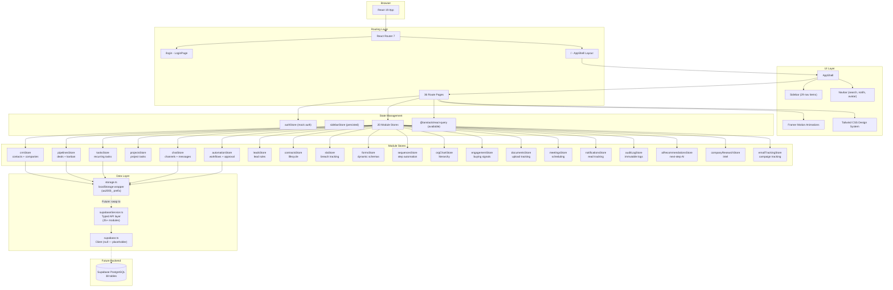

# AA2000 Connect CRM

Enterprise CRM platform for AA2000 Security & Technology Solutions Inc. — sales pipeline, lead management, marketing automation, client engagement, and operations.

## Quick Start

```bash
npm install
npm run dev       # Vite dev server with HMR
npm run build     # TypeScript check + production build
npm run lint      # ESLint
```

## Tech Stack

React 19 · TypeScript 6 · Vite 8 · Zustand 5 · Tailwind CSS 3 · React Router 7 · Framer Motion 12 · Supabase (ready to connect)

## Project Structure

```
src/
├── App.tsx              # Routes + providers
├── components/          # Layout shell (Sidebar, Navbar, AppShell)
├── pages/               # 36 route components
├── stores/              # Zustand stores (20 domain modules + 2 global)
├── services/            # API layer, localStorage, workflow templates
├── types/               # Full Supabase schema types
├── lib/supabase.ts      # Supabase client (currently placeholder)
└── index.css            # Tailwind + custom component classes
```

## Key Scripts

| Command | Description |
|---------|-------------|
| `npm run dev` | Start dev server |
| `npm run build` | Type-check + build for production |
| `npm run lint` | Run ESLint |
| `npm run preview` | Preview production build |

## Flowchart



## Architecture

**See [`ARCHITECTURE.md`](./ARCHITECTURE.md)** for:
- Complete data flow diagram
- Store pattern reference
- Route table with all 36 pages
- Supabase connection guide
- Component hierarchy
- Design system tokens
- Known limitations

## Current Status

- Fully functional SPA with localStorage persistence
- Mock auth (always authenticated as admin)
- Supabase service layer fully typed — uncomment supabase.ts, set `.env` vars, and swap stores to connect
- All 38 database tables have migration SQL in `supabase/migrations/001_full_schema.sql`
