# AA2000 Connect CRM

Enterprise CRM platform for AA2000 Security & Technology Solutions Inc. — sales pipeline, lead management, marketing automation, client engagement, incentives, KPI tracking, bidding, and operations.

## Quick Start

```bash
npm install
npm run dev       # Vite dev server with HMR
npm run build     # TypeScript check + production build
npm run lint      # ESLint
```

## Tech Stack

React 19 · TypeScript 6 · Vite 8 · Zustand 5 · Tailwind CSS 3 · React Router 7 · Framer Motion 12 · Recharts · @xyflow/react (React Flow) · @dnd-kit · TanStack Query · Axios · date-fns · lucide-react · Supabase (ready to connect)

## Project Structure

```
src/
├── App.tsx              # Routes + providers (60+ routes)
├── components/          # Layout shell (Sidebar, Navbar, AppShell, ProtectedRoute)
├── pages/               # 60+ page components in 47 directories
├── stores/              # Zustand stores (32 module stores + 2 global)
├── services/            # API layer, localStorage, workflow templates, AI builder
├── types/               # Full Supabase schema types (44 tables)
├── lib/supabase.ts      # Supabase client (currently placeholder)
└── index.css            # Tailwind + custom component classes
```

## Key Scripts

| Command | Description |
|---------|-------------|
| `npm run dev` | Start dev server |
| `npm run build` | Type-check + build for production |
| `npm run lint` | Run ESLint |
| `npm run preview` | Preview production build |

## Flowchart

```mermaid
flowchart TB
    subgraph Browser["Browser"]
        REACT["React 19 App"]
    end

    subgraph Routing["Routing Layer"]
        RR["React Router 7"]
        LOGIN["/login - LoginPage"]
        APP["/ - AppShell Layout"]
        PAGES["60+ Route Pages"]
    end

    subgraph UI["UI Layer"]
        SHELL["AppShell"]
        SIDEBAR["Sidebar (10 nav groups, role-based)"]
        NAVBAR["Navbar (search, notifs, avatar)"]
        ANIM["Framer Motion Animations"]
        TAILWIND["Tailwind CSS Design System"]
    end

    subgraph State["State Management"]
        AUTH["authStore (mock auth, 6 roles)"]
        SIDESTORE["sidebarStore (persisted)"]
        MODULES["32 Module Stores"]
        RQ["@tanstack/react-query (available)"]
    end

    subgraph Stores["Module Stores"]
        CRM["crmStore"]
        PIPE["pipelinesStore"]
        TASKS["tasksStore"]
        PROJ["projectsStore"]
        CHAT["chatStore"]
        AUTO["automationStore"]
        LEADS["leadsStore"]
        CONTR["contractsStore"]
        SLA["slaStore"]
        FORMS["formsStore"]
        SEQ["sequencesStore"]
        ORG["orgChartStore"]
        ENG["engagementStore"]
        DOCS["documentsStore"]
        MEET["meetingsStore"]
        NOTIF["notificationsStore"]
        AUDIT["auditLogStore"]
        AI_REC["aiRecommendationsStore"]
        RESEARCH["companyResearchStore"]
        EMAIL["emailTrackingStore"]
        AI_AGENTS["aiAgentsStore"]
        BID["biddingStore"]
        INCENT["incentivesStore"]
        KB["knowledgeBaseStore"]
        KPI["kpiStore"]
        MARKET["marketplaceStore"]
        POLICY["policyCenterStore"]
        CATALOG["productCatalogStore"]
        REPORTS["reportsStore"]
        SEO["seoGeoStore"]
        SERVICE["serviceManagementStore"]
        WEB["websiteIntegrationStore"]
    end

    subgraph Data["Data Layer"]
        STORAGE["storage.ts<br/>localStorage wrapper<br/>(aa2000_ prefix)"]
        SUPABASE["supabaseService.ts<br/>Typed API layer<br/>(25+ API modules)"]
        SUPA["supabase.ts<br/>Client (null — placeholder)"]
    end

    subgraph External["Future Backend"]
        SUPABASE_DB[("Supabase PostgreSQL<br/>44 tables")]
    end

    REACT --> RR
    RR --> LOGIN
    RR --> APP
    APP --> SHELL
    SHELL --> SIDEBAR
    SHELL --> NAVBAR
    SHELL --> PAGES
    PAGES --> ANIM
    PAGES --> TAILWIND

    PAGES --> AUTH
    PAGES --> MODULES
    PAGES --> RQ

    MODULES --> CRM
    MODULES --> PIPE
    MODULES --> TASKS
    MODULES --> PROJ
    MODULES --> CHAT
    MODULES --> AUTO
    MODULES --> LEADS
    MODULES --> CONTR
    MODULES --> SLA
    MODULES --> FORMS
    MODULES --> SEQ
    MODULES --> ORG
    MODULES --> ENG
    MODULES --> DOCS
    MODULES --> MEET
    MODULES --> NOTIF
    MODULES --> AUDIT
    MODULES --> AI_REC
    MODULES --> RESEARCH
    MODULES --> EMAIL
    MODULES --> AI_AGENTS
    MODULES --> BID
    MODULES --> INCENT
    MODULES --> KB
    MODULES --> KPI
    MODULES --> MARKET
    MODULES --> POLICY
    MODULES --> CATALOG
    MODULES --> REPORTS
    MODULES --> SEO
    MODULES --> SERVICE
    MODULES --> WEB

    CRM --> STORAGE
    PIPE --> STORAGE
    TASKS --> STORAGE
    CHAT --> STORAGE
    AUTO --> STORAGE

    STORAGE -.->|"Future: swap to"| SUPABASE
    SUPABASE --> SUPA
    SUPA -.-> SUPABASE_DB
```



## Architecture

**See [`ARCHITECTURE.md`](./ARCHITECTURE.md)** for:
- Complete data flow diagram
- Store pattern reference
- Route table with all 60+ pages
- Supabase connection guide
- Component hierarchy
- Design system tokens
- Known limitations

## Current Status

- Fully functional SPA with localStorage persistence
- 60+ page components across 47 module directories
- 32 Zustand module stores with seed data
- 2 global stores (auth, sidebar)
- Mock auth with 6 role-based accounts (super_admin, admin, sales_manager, sales_rep, finance, team_leader, ceo)
- Role-based sidebar visibility (10 nav groups)
- Supabase service layer fully typed (25+ API modules)
- All 44 database tables have migration SQL in `supabase/migrations/001_full_schema.sql`
- AI workflow builder (NLP prompt → workflow nodes via `aiWorkflowBuilder.ts`)
- 8 pre-built workflow automation templates
- CSV import/export for contacts
- Buying signal analysis engine (engagement scoring)
- Full incentive request workflow (draft → GM → Finance → CEO → approved/released)
- KPI monitoring, bidding/PhilGEPS management, marketplace integration
