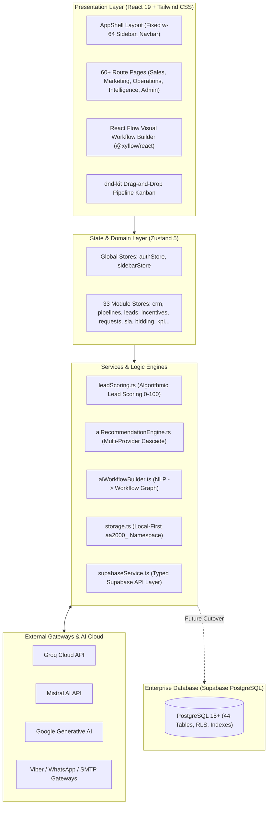

# AA2000 Connect CRM

Enterprise Customer Relationship Management (CRM) & Business Operating System (BOS) for **AA2000 Security and Technology Solutions Inc.** — engineered for commercial security, CCTV surveillance, fire detection & alarm systems (FDAS), biometric access control, networking infrastructure, and public safety integration across the Philippines.

---

## 📖 Documentation Suite (`docs/`)

All technical architecture blueprints, system diagrams, data dictionaries, user stories, and state machines are located in the [`docs/`](./docs) folder:

| Document | Primary Focus | Included Diagrams & Key Topics | Direct Link |
|---|---|---|---|
| **Entity Relationship Diagram (ERD)** | Full Database Schema & Data Dictionary | Mermaid `erDiagram`, 44+ Supabase PostgreSQL tables, keys, cascades, constraints, and field definitions | [📄 `docs/ERD.md`](./docs/ERD.md) |
| **User Stories & Acceptance Criteria** | Functional & Business Requirements | 10 Epics, 7 Personas (CEO, GM, Sales Rep, Finance, Ops, Admin, Client) with Gherkin acceptance criteria | [📄 `docs/USER_STORIES.md`](./docs/USER_STORIES.md) |
| **Data Flow Diagrams (DFD)** | System & Transactional Information Flows | **Level 0** Context Diagram, **Level 1** Process Decomposition, **Level 2** Sequences (Forms, AI, Incentives, SLA) | [📄 `docs/DATAFLOW_DIAGRAMS.md`](./docs/DATAFLOW_DIAGRAMS.md) |
| **System Architecture Blueprint** | Layered System & Technical Topology | Presentation layer, 33 Zustand domain stores, Multi-Cloud AI cascade, RBAC security matrix, deployment | [📄 `docs/SYSTEM_ARCHITECTURE.md`](./docs/SYSTEM_ARCHITECTURE.md) |
| **State Transitions & Workflows** | Finite State Machine (FSM) Specifications | Deal pipeline stages, 4-Tier Incentive approval workflow, Service ticket SLA countdown, PhilGEPS bidding | [📄 `docs/STATE_TRANSITIONS.md`](./docs/STATE_TRANSITIONS.md) |
| **Master Architecture Guide** | Comprehensive Developer Guide | Store template pattern, Supabase cutover blueprint, component hierarchy, routes table | [📐 `ARCHITECTURE.md`](./ARCHITECTURE.md) |
| **Implemented Changes Summary** | Development & Feature Changelog | Phases 1–7 security hardening, AI models, layout upgrades, and bug fixes | [📝 `AA2000_Connect_Implemented_Changes.md`](./AA2000_Connect_Implemented_Changes.md) |

### 🔍 Quick Links to Key Sections in `docs/`
* 📊 **Database ERD Diagram**: [`docs/ERD.md#2-high-level-entity-relationship-diagram-mermaid`](./docs/ERD.md#2-high-level-entity-relationship-diagram-mermaid)
* 📖 **Data Dictionary (All 44 Tables)**: [`docs/ERD.md#3-detailed-data-dictionary`](./docs/ERD.md#3-detailed-data-dictionary)
* 4️⃣ **4-Tier Incentive Approval Flow**: [`docs/DATAFLOW_DIAGRAMS.md#42-sequence-2-4-tier-incentive-approval-workflow`](./docs/DATAFLOW_DIAGRAMS.md#42-sequence-2-4-tier-incentive-approval-workflow)
* 🤖 **Multi-Provider AI Fallback Cascade**: [`docs/SYSTEM_ARCHITECTURE.md#4-multi-cloud-ai-architecture--fallback-cascade`](./docs/SYSTEM_ARCHITECTURE.md#4-multi-cloud-ai-architecture--fallback-cascade)
* 🔐 **Role-Based Access Control (RBAC) Matrix**: [`docs/SYSTEM_ARCHITECTURE.md#5-security--access-control-rbac-matrix`](./docs/SYSTEM_ARCHITECTURE.md#5-security--access-control-rbac-matrix)
* 💼 **Sales Pipeline State Transitions**: [`docs/STATE_TRANSITIONS.md#2-deal--pipeline-state-transition-diagram`](./docs/STATE_TRANSITIONS.md#2-deal--pipeline-state-transition-diagram)
* 🇵🇭 **PhilGEPS Government Bidding State Machine**: [`docs/STATE_TRANSITIONS.md#6-philgeps-public-bidding-state-machine`](./docs/STATE_TRANSITIONS.md#6-philgeps-public-bidding-state-machine)

---

## ⚡ Quick Start

### Prerequisites
* **Node.js**: v18.0 or higher
* **npm**: v9.0 or higher

### Installation & Development
```bash
# 1. Clone or navigate to the workspace
cd "AA2000 Connect (CRM)"

# 2. Install dependencies
npm install

# 3. Launch Vite HMR development server
npm run dev

# 4. Run TypeScript check & production build
npm run build

# 5. Run ESLint code inspection
npm run lint
```

The application will be available at `http://localhost:5173`.

---

## 👥 Demo Role Accounts

The application features instant role-switching on the `/login` page to test all permission tiers and workflows:

| Role Persona | Demo Email | Access Permissions & Special Workflows |
|---|---|---|
| **Super Admin** | `super@aa2000.ph` | Full administrative root access, IT credentials, audit logs, system branding |
| **CEO / Executive** | `ceo@aa2000.ph` | Strategic KPI scorecards, business intelligence, final 4th-tier incentive signoff |
| **General Manager** | `gm@aa2000.ph` | Pipeline velocity, 7-point GM incentive approval checklist, PhilGEPS tenders |
| **Sales Manager** | `manager@aa2000.ph` | Territory assignment rules, quotation margin review, sales team scorecards |
| **Sales Representative**| `rep@aa2000.ph` | Contact CSV import/export, Kanban deal pipeline, AI next-steps, incentive filing |
| **Finance Officer** | `finance@aa2000.ph`| Gross Profit validation, Official Receipt (OR) audits, commission clearance |
| **Operations Lead** | `ops@aa2000.ph` | Service tickets, SLA breach monitoring, PMS/CMS recurring maintenance contracts |

---

## 🛠️ Technology Stack

| Layer | Technology | Version | Description |
|---|---|---|---|
| **Core Framework** | React | 19.0 | Concurrent React with functional components and modern hooks |
| **Language** | TypeScript | 6.0 | Strict type safety across stores, services, and database schemas |
| **Bundler & Tooling**| Vite | 8.0 | Instant Hot Module Replacement (HMR) and optimized Rolldown packaging |
| **Routing** | React Router | 7.0 | Role-guarded application routing across 60+ pages |
| **State Management** | Zustand | 5.0 | 33 domain-specific module stores with zero-latency synchronization |
| **Visual Workflow** | @xyflow/react | 12.x | Visual drag-and-drop node graph canvas for automation flows |
| **Drag & Drop** | @dnd-kit | 6.x | Accessible drag-and-drop Kanban pipeline boards |
| **Animations** | Framer Motion | 12.x | High-end micro-interactions, modal overlays, page transitions |
| **CSS & Design** | Tailwind CSS | 3.4 | Enterprise theme tokens, custom glassmorphism, responsive utilities |
| **Data Visualization**| Recharts | 2.15 | Responsive SVG charts for revenue velocity, margins, and KPI tracking |
| **Icons** | Lucide React | 1.16 | Comprehensive icon library |
| **Cloud AI Cascade** | Groq / Mistral / Gemini| Cloud APIs | 3-tier fallback LLM engine (Qwen 2.5 32B $\rightarrow$ Mistral $\rightarrow$ Gemini 2.5 Flash) |
| **Active Storage** | localStorage | Native Web | Zero-latency local persistence with `aa2000_*` namespace isolation |
| **Backend (Ready)** | Supabase PostgreSQL | 15+ | 44 relational tables, Row-Level Security, foreign key cascades, JSONB schemas |

---

## 🌟 Core System Modules

### 1. Inbound Ingestion & Algorithmic Lead Scoring
* **Dynamic Web Forms**: Auto-generates CRM contact and lead records directly from public form submissions.
* **Lead Scoring Engine (`leadScoring.ts`)**: Dynamically computes buying temperature (0–100 score, letter grades A+ to D) using engagement telemetry, company size, and high-intent link clicks.
* **Territory Routing**: Rule-based automatic distribution of leads based on geography, service type, and deal scope.

### 2. Commercial Pipeline & Opportunity Management
* **Kanban Pipeline Board**: Drag-and-drop deals across sales stages (Inquiry $\rightarrow$ Qualified $\rightarrow$ Site Survey $\rightarrow$ Proposal Sent $\rightarrow$ Negotiation $\rightarrow$ Won/Lost).
* **Quotation Webhook Service**: Integrates with external quoting tools to automatically advance pipeline stages upon quote dispatch, client views, or deposit receipt.
* **Loss Reason Audit**: Mandatory audit capture for lost or abandoned opportunities to identify pricing and competitor friction.

### 3. Multi-Tier Incentive & Commission Approval Lifecycle
* **Automated GP Slabs**: Computes Gross Profit = Total Revenue minus Equipment/Subcontractor BOM cost, calculating commission based on corporate incentive slabs.
* **GM 7-Point Compliance Review**: Requires General Manager verification across 7 mandatory items (signed contract, full collection, signed DR, warranty card, technical sign-off, official receipt, clearance form).
* **Finance & CEO Governance**: Dual-custody financial clearance and executive signoff before commission release.

### 4. Multi-Provider AI Fallback Engine
* **Contextual Recommendations**: Generates next-best-action sales recommendations, prioritized follow-ups, and pre-composed Viber/Email drafts.
* **Resilient Cascade**: Primary query to **Groq Cloud (Qwen 2.5 32B)** $\rightarrow$ secondary failover to **Mistral AI** $\rightarrow$ tertiary failover to **Google Gemini 2.5 Flash** $\rightarrow$ local heuristic regex compiler.
* **Dynamic AI Agent Center**: Deployable AI agents with engine model switchers and automatic vision locks for OCR/List scanners.

### 5. Service Desk, Warranty Ticketing & SLA Monitor
* **Service Request Ticketing**: Sequential ticket IDs (e.g. `REQ-2026-0042`) with priority categories (`urgent`, `high`, `medium`, `low`).
* **SLA Countdown & Escalation**: Visual countdown timers with automated breach detection and emergency managerial alerts.
* **PMS & CMS Governance**: Recurring Preventive Maintenance schedules and Corrective Maintenance emergency dispatch.

### 6. PhilGEPS Public Bidding & Commercial Tenders
* **RA 9184 Compliance**: Tracking for Philippine Government Procurement Reform Act tenders.
* **Statutory Checklists**: Class A legal eligibility documents, PCAB license verification, Single Largest Completed Contract (SLCC), NFCC, and Omnibus Sworn Statements.
* **Margin Tracking**: Real-time comparison of Approved Budget for the Contract (ABC) against AA2000 submitted bid amounts.

### 7. Product Catalog & Live Google Grounding
* **Hardware Catalog**: Pre-seeded products across CCTV, FDAS, Biometrics, Networking, Structured Cabling, and Backup Power.
* **Live Web Grounding**: Instant switching to Google Search Grounding to fetch external datasheets, manufacturer pinouts, and fire safety codes with cited reference URLs.

---

## 🗺️ High-Level System Architecture Diagram


```mermaid
flowchart TB
    subgraph UI_LAYER["Presentation Layer (React 19 + Tailwind CSS)"]
        APP["AppShell Layout (Fixed w-64 Sidebar, Navbar)"]
        PAGES["60+ Route Pages (Sales, Marketing, Operations, Intelligence, Admin)"]
        BUILDER["React Flow Visual Workflow Builder (@xyflow/react)"]
        KANBAN["dnd-kit Drag-and-Drop Pipeline Kanban"]
    end

    subgraph STATE_LAYER["State & Domain Layer (Zustand 5)"]
        GLOBAL["Global Stores: authStore, sidebarStore"]
        MODULES["33 Module Stores: crm, pipelines, leads, incentives, requests, sla, bidding, kpi..."]
    end

    subgraph SERVICE_LAYER["Services & Logic Engines"]
        SCORING["leadScoring.ts (Algorithmic Lead Scoring 0-100)"]
        AI_REC["aiRecommendationEngine.ts (Multi-Provider Cascade)"]
        AI_FLOW["aiWorkflowBuilder.ts (NLP -> Workflow Graph)"]
        STORAGE["storage.ts (Local-First aa2000_ Namespace)"]
        SUPABASE_SVC["supabaseService.ts (Typed Supabase API Layer)"]
    end

    subgraph CLOUD_SERVICES["External Gateways & AI Cloud"]
        GROQ["Groq Cloud API"]
        MISTRAL["Mistral AI API"]
        GEMINI["Google Generative AI"]
        COMMS["Viber / WhatsApp / SMTP Gateways"]
    end

    subgraph DATABASE_LAYER["Enterprise Database (Supabase PostgreSQL)"]
        POSTGRES[("PostgreSQL 15+ (44 Tables, RLS, Indexes)")]
    end

    UI_LAYER --> STATE_LAYER
    STATE_LAYER --> SERVICE_LAYER
    SERVICE_LAYER <--> CLOUD_SERVICES
    SERVICE_LAYER -.->|"Future Cutover"| DATABASE_LAYER
```

---

## 🔒 Security & Philippine DPA Compliance

* **Role-Based Access Control (RBAC)**: Enforced via `ProtectedRoute.tsx` with view gating for `super_admin`, `admin`, `sales_manager`, `sales_rep`, `finance`, `team_leader`, and `ceo`.
* **Philippine Data Privacy Act of 2012 (RA 10173)**: Native contact consent tracking, retention date enforcement, and Data Subject Request (DSR) ticketing.
* **Immutable Audit Trails**: All authentication events, deal stage movements, and approvals are recorded in `auditLogStore` and the database `audit_logs` table.

---

## 📄 License & Intellectual Property

Copyright © 2026 **AA2000 Security and Technology Solutions Inc.** All rights reserved. Proprietary and confidential enterprise software.
