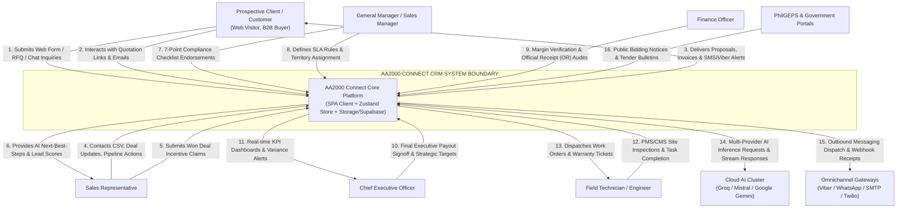
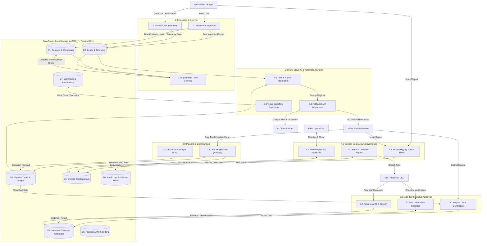
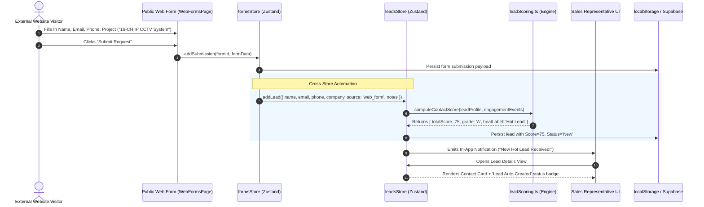
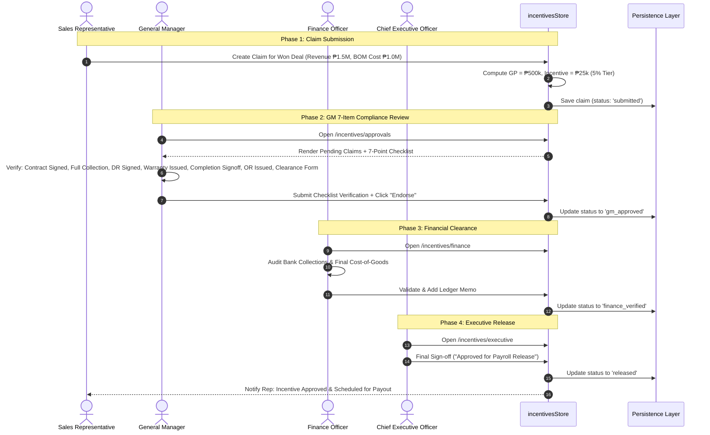
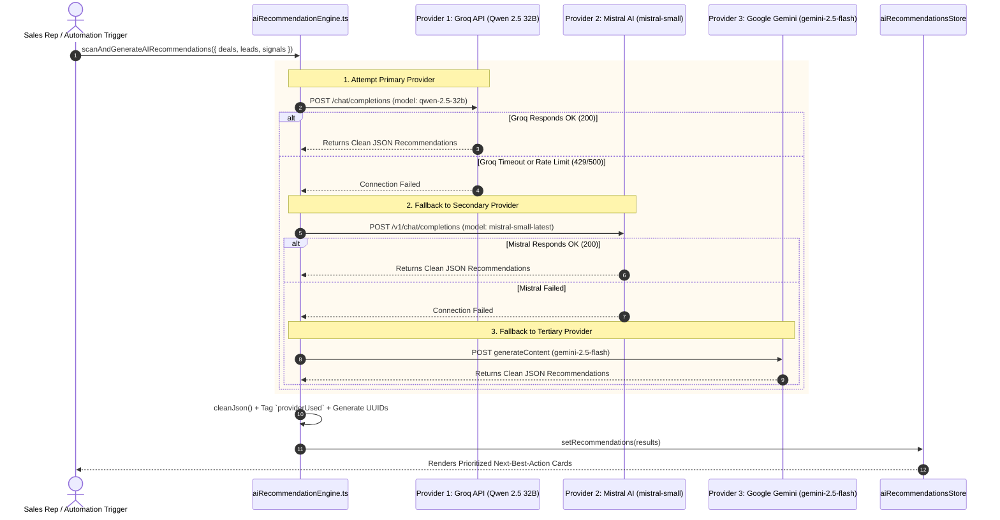
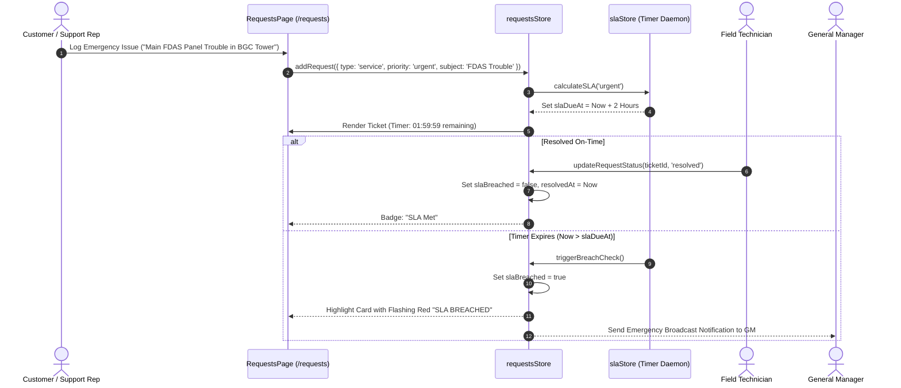

# AA2000 Connect — Data Flow Diagrams (DFD) Specification

## 1. Overview

This document specifies the Data Flow Diagrams (DFDs) for **AA2000 Connect (CRM)**, capturing the flow of data through external entities, internal processing subsystems, local/cloud data stores, and third-party gateways.

---

## 2. Level 0: System Context Diagram

The Context Diagram defines the system boundary for AA2000 Connect, illustrating inputs and outputs with external actors and cloud services.

---

## 3. Level 1: Subsystem Process Decomposition Diagram

The Level 1 DFD decomposes the core platform into nine primary functional processes interacting with shared and dedicated data stores.

---

## 4. Level 2: Transactional Sequence Dataflows

### 4.1 Sequence 1: Public Web Form to Lead & Auto-Scoring Flow

---

### 4.2 Sequence 2: 4-Tier Incentive Approval Workflow

---

### 4.3 Sequence 3: Multi-Provider AI Fallback Engine Flow

---

### 4.4 Sequence 4: Customer Support Ticket SLA Countdown & Breach Flow

