# AA2000 Connect — Entity Relationship Diagram (ERD) & Data Dictionary

## 1. Executive Overview

This document specifies the complete Entity-Relationship Diagram (ERD), schema architecture, and data dictionary for **AA2000 Connect (CRM)**, the enterprise business operating system for **AA2000 Security and Technology Solutions Inc.** (specializing in CCTV surveillance, fire detection & alarm systems [FDAS], biometric access control, commercial networking, and public safety infrastructure in the Philippines).

The data model is architected for both the active local-first Zustand/localStorage runtime and the complete Supabase PostgreSQL relational schema defined in `supabase/migrations/001_full_schema.sql` (44 core relational tables) plus domain extensions.

---

## 2. High-Level Entity Relationship Diagram (Mermaid)

```mermaid
erDiagram
    %% Core Entities & CRM
    COMPANIES ||--o{ CONTACTS : employs
    COMPANIES ||--o{ CONTACT_RELATIONSHIPS : "has hierarchy"
    COMPANIES ||--o{ ACCOUNT_TEAM_MEMBERS : assigned
    COMPANIES ||--o{ COMPANY_RESEARCH : researched
    COMPANIES ||--o{ APP_REQUESTS : submits
    COMPANIES ||--o{ PROJECTS : commissions

    CONTACTS ||--o{ CONTACT_RELATIONSHIPS : participates
    CONTACTS ||--o{ LEADS : originates
    CONTACTS ||--o{ ACTIVITIES : performs
    CONTACTS ||--o{ APP_REQUESTS : files
    CONTACTS ||--o{ DATA_SUBJECT_REQUESTS : requests

    %% Service Types & Core Process Records
    SERVICE_TYPES ||--o{ SERVICES : classifies
    SERVICE_TYPES ||--o{ PROCESS_DEFINITIONS : drives
    SERVICE_TYPES ||--o{ FORM_DEFINITIONS : targets
    SERVICE_TYPES ||--o{ SLA_POLICIES : governs
    SERVICES ||--o{ SERVICE_RECORDS : instantiated_as

    %% Pipeline, Activities & Stage History
    SERVICE_RECORDS ||--o{ STAGE_HISTORY : logs
    SERVICE_RECORDS ||--o{ ACTIVITIES : tracks
    SERVICE_RECORDS ||--o{ PROCESS_INSTANCES : executes
    SERVICE_RECORDS ||--o{ DOCUMENTS : attaches
    SERVICE_RECORDS ||--o{ TASKS : assigns
    SERVICE_RECORDS ||--o{ NOTES : annotates
    SERVICE_RECORDS ||--o{ SEQUENCE_ENROLLMENTS : enrolled
    SERVICE_RECORDS ||--o{ CONTRACTS : binds
    SERVICE_RECORDS ||--o{ MAINTENANCE_CONTRACTS : services
    SERVICE_RECORDS ||--o{ MEETINGS : schedules
    SERVICE_RECORDS ||--o{ SLA_TRACKING : monitors
    SERVICE_RECORDS ||--o{ AI_RECOMMENDATIONS : generates
    SERVICE_RECORDS ||--o{ CHAT_CHANNELS : associates
    SERVICE_RECORDS ||--o{ EMAIL_EVENTS : records

    %% BPM & Approvals
    PROCESS_DEFINITIONS ||--o{ PROCESS_INSTANCES : guides
    PROCESS_INSTANCES ||--o{ APPROVAL_REQUESTS : requires

    %% Web Forms & Lead Generation
    FORM_DEFINITIONS ||--o{ FORM_SUBMISSIONS : receives
    FORM_SUBMISSIONS ||--o| SERVICE_RECORDS : generates

    %% Chat & Messaging
    CHAT_CHANNELS ||--o{ CHAT_MESSAGES : contains
    CHATBOT_CONVERSATIONS ||--o{ CHATBOT_MESSAGES : logs
    CHATBOT_CONVERSATIONS ||--o| LEADS : spawns

    %% Email Tracking & Buying Signals
    EMAIL_EVENTS ||--o{ EMAIL_LINKS : embeds
    EMAIL_LINKS ||--o{ EMAIL_LINK_CLICKS : tracks

    %% Sequences & Workflows
    SEQUENCES ||--o{ SEQUENCE_ENROLLMENTS : defines

    %% Service Desk / App Requests
    APP_REQUESTS }o--|| CONTACTS : requested_by
    APP_REQUESTS }o--|| COMPANIES : requested_for

    %% Projects & Tasks
    PROJECTS ||--o{ PROJECT_TASKS : contains

    %% Contracts & Maintenance
    CONTRACTS ||--o| DOCUMENTS : references
    CONTRACTS ||--o{ MAINTENANCE_CONTRACTS : provisions
    MAINTENANCE_CONTRACTS ||--o{ MAINTENANCE_TICKETS : creates

    %% SLA & Policies
    SLA_POLICIES ||--o{ SLA_TRACKING : enforces

    %% Security & Governance
    USER_ROLES ||--o{ AUDIT_LOGS : performs
    LEADS ||--o{ NOTIFICATIONS : triggers

    %% Extended Domain Entities
    INCENTIVE_REQUESTS ||--o{ APPROVAL_REQUESTS : routes
    BIDDING_PROJECTS ||--o{ DOCUMENTS : requires
    MARKETPLACE_LISTINGS ||--o{ MARKETPLACE_INQUIRIES : generates
```



---

## 3. Detailed Data Dictionary

### 3.1 Core Data Model

#### `service_types`
Defines categories and metadata schemas for commercial services (CCTV, FDAS, Biometrics, Managed Maintenance, Turnkey IT).
| Column | Type | Constraints | Description |
|---|---|---|---|
| `id` | `uuid` | Primary Key, default `gen_random_uuid()` | Unique identifier |
| `key` | `text` | Unique, Not Null | Unique service code (e.g. `cctv_enterprise`, `fdas_commercial`) |
| `label` | `text` | Not Null | User-facing display title |
| `field_schema` | `jsonb` | Not Null | JSON Schema defining dynamic fields for service execution |
| `category` | `text` | Default `'process'` | Classification category (`process`, `maintenance`, `product`) |

#### `services`
Concrete catalog or operational services derived from a `service_type`.
| Column | Type | Constraints | Description |
|---|---|---|---|
| `id` | `uuid` | Primary Key | Unique service identifier |
| `service_type_id` | `uuid` | Foreign Key -> `service_types(id)` ON DELETE CASCADE | Associated service type definition |
| `name` | `text` | Not Null | Service package name |
| `config` | `jsonb` | Default `'{}'` | Service configuration options, default pricing parameters |
| `created_at` | `timestamptz`| Default `now()` | Record creation timestamp |

#### `service_records` (Core Deal / Execution Record)
Central transactional entity representing a deal, opportunity, project pipeline execution, or active client installation.
| Column | Type | Constraints | Description |
|---|---|---|---|
| `id` | `uuid` | Primary Key | Transactional record UUID |
| `service_id` | `uuid` | Foreign Key -> `services(id)` ON DELETE CASCADE | Underlying service package |
| `fields` | `jsonb` | Not Null, Default `'{}'` | Dynamic payload conforming to `service_types.field_schema` |
| `status` | `text` | Nullable | Current stage or lifecycle status |
| `assigned_to` | `uuid` | Indexed | User ID of the assigned sales rep or technical manager |
| `won_lost_status` | `text` | Nullable | Outcome status (`Open`, `Won`, `Lost`, `Abandoned`) |
| `lost_reason` | `text` | Nullable | Detailed reason if deal was lost |
| `closed_at` | `timestamptz`| Nullable | Date and time when deal was closed |
| `quotation_id` | `uuid` | Nullable | Linked quotation document/number |
| `created_at` | `timestamptz`| Default `now()` | Inception timestamp |
| `updated_at` | `timestamptz`| Default `now()` | Last modification timestamp |

---

### 3.2 CRM: Contacts & Companies

#### `companies` (Accounts)
Corporate clients, general contractors, property management firms, government agencies, and system integrators.
| Column | Type | Constraints | Description |
|---|---|---|---|
| `id` | `uuid` | Primary Key | Organization UUID |
| `name` | `text` | Not Null | Registered company or trading name |
| `industry` | `text` | Nullable | Business vertical (e.g. Retail, Real Estate, Manufacturing) |
| `website` | `text` | Nullable | Company website URL |
| `type` | `text` | Nullable | Account classification (`End User`, `Contractor`, `Dealer`, `Government`) |
| `status` | `text` | Default `'Active'` | Account lifecycle status (`Active`, `Inactive`, `Prospect`) |
| `assigned_to` | `uuid` | Nullable | Account executive user ID |
| `created_at` | `timestamptz`| Default `now()` | Account onboarding date |

#### `contacts`
Individual stakeholders, procurement officers, safety heads, facility engineers, and building administrators.
| Column | Type | Constraints | Description |
|---|---|---|---|
| `id` | `uuid` | Primary Key | Contact UUID |
| `name` | `text` | Not Null | Full contact name |
| `email` | `text` | Nullable | Primary business email |
| `phone` | `text` | Nullable | Mobile or landline phone |
| `company_id` | `uuid` | Foreign Key -> `companies(id)` ON DELETE SET NULL | Linked employer/organization |
| `status` | `text` | Default `'Lead'` | Status (`Lead`, `Prospect`, `Customer`, `VIP`) |
| `score` | `int` | Default `0` | Algorithmic engagement & buying intent score (0 - 100) |
| `assigned_to` | `uuid` | Indexed | Assigned sales representative |
| `tags` | `jsonb` | Default `'[]'` | Multi-tag classification array (`["VIP", "Enterprise", "BFP-Cert"]`) |
| `consent_given` | `boolean` | Default `false` | Republic Act 10173 (Philippine DPA) compliance flag |
| `data_retention_until` | `date` | Nullable | DPA data expiration date |
| `created_at` | `timestamptz`| Default `now()` | Contact timestamp |

#### `contact_relationships`
Hierarchical organizational chart mapping corporate decision-making chains.
| Column | Type | Constraints | Description |
|---|---|---|---|
| `id` | `uuid` | Primary Key | Relationship UUID |
| `company_id` | `uuid` | Foreign Key -> `companies(id)` ON DELETE CASCADE | Associated enterprise |
| `contact_id` | `uuid` | Foreign Key -> `contacts(id)` ON DELETE CASCADE | Subject individual |
| `reports_to_contact_id`| `uuid` | Foreign Key -> `contacts(id)` ON DELETE SET NULL | Direct supervisor/decision-maker |
| `department` | `text` | Nullable | Department (Security, IT, Engineering, Procurement) |
| `title` | `text` | Nullable | Formal job title |

#### `account_team_members`
Cross-functional internal team members dedicated to an enterprise account.
| Column | Type | Constraints | Description |
|---|---|---|---|
| `id` | `uuid` | Primary Key | Membership UUID |
| `company_id` | `uuid` | Foreign Key -> `companies(id)` ON DELETE CASCADE | Client enterprise |
| `user_id` | `uuid` | Not Null | Internal employee user ID |
| `role` | `text` | Nullable | Role in account (`Lead Account Exec`, `Systems Engineer`, `Estimator`) |

---

### 3.3 Ingestion & Intelligence

#### `leads`
Prospects captured across web forms, Facebook Marketplace, PhilGEPS tenders, Viber, and cold calls.
| Column | Type | Constraints | Description |
|---|---|---|---|
| `id` | `uuid` | Primary Key | Lead UUID |
| `contact_id` | `uuid` | Foreign Key -> `contacts(id)` ON DELETE CASCADE | Linked contact profile |
| `source` | `text` | Nullable | Attribution (`web_form`, `fb_marketplace`, `philgeps`, `walk_in`) |
| `ad_campaign` | `text` | Nullable | Marketing campaign UTM attribution |
| `ad_creative` | `text` | Nullable | Creative variant identifier |
| `assigned_to` | `uuid` | Indexed | Assigned sales rep |
| `status` | `text` | Nullable | Ingestion status (`New`, `Contacted`, `Qualified`, `Converted`, `Disqualified`) |
| `created_at` | `timestamptz`| Default `now()` | Ingestion timestamp |

#### `company_research`
Pre-call intelligence and competitive intelligence gathering.
| Column | Type | Constraints | Description |
|---|---|---|---|
| `id` | `uuid` | Primary Key | Research UUID |
| `company_id` | `uuid` | Foreign Key -> `companies(id)` ON DELETE CASCADE | Target client enterprise |
| `tier` | `text` | Nullable | Client tiering (`Tier 1 - Conglomerate`, `Tier 2 - Mid-market`, `Tier 3 - SME`) |
| `is_decision_maker` | `boolean` | Nullable | Target contact verification status |
| `existing_security_vendor` | `text` | Nullable | Competitor vendor currently installed (e.g. Hikvision, Dahua, Honeywell) |
| `existing_system_age_estimate`| `text`| Nullable | Estimated installation age (e.g. 5+ years, obsolete analog) |
| `compliance_gap_notes` | `text` | Nullable | Bureau of Fire Protection (BFP) or DOLE compliance deficiencies noted |
| `outreach_angles` | `jsonb` | Nullable | Recommended AI pitches, pain points, and value propositions |
| `created_at` | `timestamptz`| Default `now()` | Research completion timestamp |

---

### 3.4 Pipeline, BPM, & Approvals

#### `stage_history`
Audit trail of pipeline movements across sales stages.
| Column | Type | Constraints | Description |
|---|---|---|---|
| `id` | `uuid` | Primary Key | History UUID |
| `service_record_id` | `uuid` | Foreign Key -> `service_records(id)` ON DELETE CASCADE | Target deal record |
| `from_stage` | `text` | Nullable | Origin pipeline stage |
| `to_stage` | `text` | Nullable | Destination pipeline stage |
| `changed_by` | `uuid` | Nullable | User who dragged/transitioned the deal |
| `changed_at` | `timestamptz`| Default `now()` | Transition timestamp |

#### `process_definitions`
Visual BPM workflow schemas modeled in the system.
| Column | Type | Constraints | Description |
|---|---|---|---|
| `id` | `uuid` | Primary Key | Process schema UUID |
| `name` | `text` | Not Null | Workflow name |
| `steps` | `jsonb` | Not Null | Structured node and edge array (ReactFlow compatible) |
| `service_type_id` | `uuid` | Foreign Key -> `service_types(id)` ON DELETE SET NULL | Associated service type |
| `source_prompt` | `text` | Nullable | Natural language prompt used by AI Workflow Builder |
| `created_at` | `timestamptz`| Default `now()` | Creation timestamp |

#### `process_instances`
Running execution state of a specific workflow instance.
| Column | Type | Constraints | Description |
|---|---|---|---|
| `id` | `uuid` | Primary Key | Instance UUID |
| `process_definition_id` | `uuid` | Foreign Key -> `process_definitions(id)` ON DELETE CASCADE | Parent workflow schema |
| `service_record_id` | `uuid` | Foreign Key -> `service_records(id)` ON DELETE CASCADE | Associated deal / ticket |
| `current_step` | `int` | Default `0` | Pointer to currently active step index |
| `status` | `text` | Default `'in_progress'` | Status (`in_progress`, `completed`, `suspended`, `cancelled`) |
| `started_at` | `timestamptz`| Default `now()` | Execution start timestamp |

#### `approval_requests`
Multi-tier governance requests (Discounts, Special Terms, Incentives, Custom BOM).
| Column | Type | Constraints | Description |
|---|---|---|---|
| `id` | `uuid` | Primary Key | Request UUID |
| `process_instance_id` | `uuid` | Foreign Key -> `process_instances(id)` ON DELETE CASCADE | Associated process instance |
| `requested_by` | `uuid` | Nullable | User requesting sign-off |
| `approver_id` | `uuid` | Nullable | Designated approver (GM, Finance, CEO) |
| `status` | `text` | Default `'pending'` | Status (`pending`, `approved`, `rejected`, `escalated`) |
| `comment` | `text` | Nullable | Justification or rejection notes |
| `requested_at` | `timestamptz`| Default `now()` | Request submission timestamp |
| `resolved_at` | `timestamptz`| Nullable | Resolution timestamp |

---

### 3.5 Web Forms, Chat, Email & Activity Tracking

#### `form_definitions`
Dynamic public web form builder schemas.
| Column | Type | Constraints | Description |
|---|---|---|---|
| `id` | `uuid` | Primary Key | Form UUID |
| `name` | `text` | Not Null | Public form title (e.g. "Free CCTV Site Survey") |
| `field_schema` | `jsonb` | Not Null | Input field specifications, validation rules, layout |
| `target_service_type_id`| `uuid` | Foreign Key -> `service_types(id)` ON DELETE SET NULL | Target service categorization |
| `created_at` | `timestamptz`| Default `now()` | Form creation timestamp |

#### `form_submissions`
Payloads captured from external website inquiries.
| Column | Type | Constraints | Description |
|---|---|---|---|
| `id` | `uuid` | Primary Key | Submission UUID |
| `form_id` | `uuid` | Foreign Key -> `form_definitions(id)` ON DELETE CASCADE | Parent form |
| `data` | `jsonb` | Not Null | Key-value pairs submitted by visitor |
| `created_service_record_id`| `uuid` | Foreign Key -> `service_records(id)` ON DELETE SET NULL | Auto-generated CRM record ID |
| `submitted_at` | `timestamptz`| Default `now()` | Submission timestamp |

#### `chat_channels` & `chat_messages`
Internal employee collaboration rooms and deal-linked war-rooms.
| Column | Type | Constraints | Description |
|---|---|---|---|
| `chat_channels.id` | `uuid` | Primary Key | Channel UUID |
| `chat_channels.name`| `text` | Nullable | Channel title |
| `chat_channels.is_dm`| `boolean` | Default `false` | True if private direct message |
| `chat_channels.service_record_id`| `uuid` | Foreign Key -> `service_records(id)` | Deal/Project chat room |
| `chat_messages.id` | `uuid` | Primary Key | Message UUID |
| `chat_messages.channel_id`| `uuid` | Foreign Key -> `chat_channels(id)` ON DELETE CASCADE | Channel reference |
| `chat_messages.sender_id` | `uuid` | Not Null | Employee sender |
| `chat_messages.content` | `text` | Not Null | Message body |
| `chat_messages.sent_at` | `timestamptz` | Default `now()` | Sent timestamp |

#### `email_events`, `email_links`, & `email_link_clicks`
Telemetry engine computing client engagement and buying signals.
| Column | Type | Constraints | Description |
|---|---|---|---|
| `email_events.id` | `uuid` | Primary Key | Event UUID |
| `email_events.service_record_id`| `uuid` | Foreign Key -> `service_records(id)` ON DELETE CASCADE | Associated deal |
| `email_events.type` | `text` | Nullable | Event type (`sent`, `opened`, `replied`, `bounced`) |
| `email_links.id` | `uuid` | Primary Key | Tracked link UUID |
| `email_links.email_event_id`| `uuid` | Foreign Key -> `email_events(id)` ON DELETE CASCADE | Parent email dispatch |
| `email_links.url` | `text` | Not Null | Destination URL (e.g. Quotation PDF, spec sheet) |
| `email_links.label` | `text` | Nullable | Human-readable tag (e.g. "CCTV Price Proposal") |
| `email_link_clicks.id` | `uuid` | Primary Key | Click event UUID |
| `email_link_clicks.email_link_id`| `uuid` | Foreign Key -> `email_links(id)` ON DELETE CASCADE | Target link |
| `email_link_clicks.clicked_at` | `timestamptz` | Default `now()` | High-intent signal click time |

---

### 3.6 Service Desk, Operations, Projects & Maintenance

#### `app_requests` (Ticketing & Service Desk)
Post-sales service requests, warranty tickets, engineering inquiries, and emergency repairs.
| Column | Type | Constraints | Description |
|---|---|---|---|
| `id` | `uuid` | Primary Key | Ticket UUID |
| `request_number` | `text` | Not Null | Human-readable ticket code (e.g. `REQ-2026-0042`) |
| `type` | `text` | Nullable | Category (`service`, `support`, `inquiry`, `complaint`, `internal`) |
| `priority` | `text` | Default `'medium'` | Severity (`low`, `medium`, `high`, `urgent`) |
| `status` | `text` | Default `'new'` | Stage (`new`, `assigned`, `in_progress`, `resolved`, `closed`) |
| `subject` | `text` | Not Null | Short issue summary |
| `description` | `text` | Nullable | Exhaustive incident/request breakdown |
| `contact_id` | `uuid` | Foreign Key -> `contacts(id)` ON DELETE SET NULL | Requesting client contact |
| `company_id` | `uuid` | Foreign Key -> `companies(id)` ON DELETE SET NULL | Client enterprise |
| `company_name` | `text` | Nullable | Denormalized company title for instant UI rendering |
| `assigned_to` | `uuid` | Indexed | Technician or support engineer user ID |
| `source` | `text` | Default `'manual'` | Origin (`web_form`, `email`, `phone`, `chat`, `manual`) |
| `sla_due_at` | `timestamptz`| Nullable | Timestamp deadline calculated via SLA policy |
| `sla_breached` | `boolean` | Default `false` | True if response or resolution deadline passed |
| `resolved_at` | `timestamptz`| Nullable | Time incident resolved |
| `created_at` | `timestamptz`| Default `now()` | Creation timestamp |

#### `projects` & `project_tasks`
Installation, structured cabling, civil works, and system commissioning project management.
| Column | Type | Constraints | Description |
|---|---|---|---|
| `projects.id` | `uuid` | Primary Key | Project UUID |
| `projects.name` | `text` | Not Null | Project title (e.g. "BGC Tower 2 FDAS Overhaul") |
| `projects.description` | `text` | Nullable | Scope of work details |
| `projects.status` | `text` | Default `'planning'` | Stage (`planning`, `active`, `on_hold`, `completed`, `cancelled`) |
| `projects.deal_id` | `uuid` | Nullable | Closed-Won deal link |
| `projects.contact_id` | `uuid` | Foreign Key -> `contacts(id)` | Client project director |
| `projects.company_id` | `uuid` | Foreign Key -> `companies(id)` | Client organization |
| `projects.start_date` | `date` | Nullable | Mobilization date |
| `projects.end_date` | `date` | Nullable | Handover / commissioning target |
| `projects.team_members`| `jsonb` | Default `'[]'` | Assigned field engineers & project managers |
| `project_tasks.id` | `uuid` | Primary Key | Task UUID |
| `project_tasks.project_id`| `uuid` | Foreign Key -> `projects(id)` ON DELETE CASCADE | Parent project |
| `project_tasks.title` | `text` | Not Null | Task title (e.g. "Install 16CH NVR & Rackmount") |
| `project_tasks.status`| `text` | Default `'todo'` | Progress (`todo`, `in_progress`, `review`, `done`) |
| `project_tasks.priority`| `text` | Default `'medium'` | Urgency (`low`, `medium`, `high`, `critical`) |
| `project_tasks.assigned_to`| `uuid`| Indexed | Field technician user ID |
| `project_tasks.due_date`| `date` | Nullable | Due date |
| `project_tasks.depends_on`| `jsonb`| Default `'[]'` | Dependency array of preceding task IDs (Gantt) |

#### `contracts`, `maintenance_contracts`, & `maintenance_tickets`
PMS (Preventive Maintenance Service) and CMS (Corrective Maintenance Service) governance.
| Column | Type | Constraints | Description |
|---|---|---|---|
| `contracts.id` | `uuid` | Primary Key | Master Contract UUID |
| `contracts.service_record_id` | `uuid` | Foreign Key -> `service_records(id)` ON DELETE CASCADE | Associated sales record |
| `contracts.document_id` | `uuid` | Foreign Key -> `documents(id)` ON DELETE SET NULL | Signed contract PDF |
| `contracts.start_date` | `date` | Nullable | Effective start date |
| `contracts.end_date` | `date` | Nullable | Expiration / renewal date |
| `contracts.renewal_alert_days`| `int` | Default `30` | Advance notice alert threshold (days) |
| `contracts.risk_level` | `text` | Nullable | Churn risk evaluation (`low`, `medium`, `high`) |
| `maintenance_contracts.id` | `uuid` | Primary Key | PMS contract UUID |
| `maintenance_contracts.maintenance_type` | `text` | Nullable | Maintenance tier (`Quarterly PMS`, `Comprehensive`, `Labor Only`) |
| `maintenance_contracts.frequency` | `text` | Nullable | Inspection cycle (`Monthly`, `Quarterly`, `Bi-Annual`, `Annual`) |
| `maintenance_tickets.id`| `uuid` | Primary Key | Maintenance ticket UUID |
| `maintenance_tickets.maintenance_contract_id` | `uuid` | Foreign Key -> `maintenance_contracts(id)` ON DELETE CASCADE | Parent PMS contract |
| `maintenance_tickets.type`| `text` | Not Null | Type (`Preventive`, `Emergency Callout`, `Component Replacement`) |
| `maintenance_tickets.status`| `text` | Default `'open'` | Status (`open`, `scheduled`, `in_progress`, `completed`) |
| `maintenance_tickets.scheduled_at`| `timestamptz` | Nullable | Scheduled site visit timestamp |
| `maintenance_tickets.assigned_technician`| `uuid`| Nullable | Field service engineer |

---

### 3.7 SLA & AI Recommendations

#### `sla_policies` & `sla_tracking`
Response and resolution time guarantees per service tier.
| Column | Type | Constraints | Description |
|---|---|---|---|
| `sla_policies.id` | `uuid` | Primary Key | Policy UUID |
| `sla_policies.service_type_id`| `uuid` | Foreign Key -> `service_types(id)` ON DELETE CASCADE | Governed service type |
| `sla_policies.name` | `text` | Nullable | Policy name (e.g. "Critical FDAS 2-Hour Response") |
| `sla_policies.response_time_minutes`| `int` | Nullable | First response time commitment in minutes |
| `sla_policies.resolution_time_minutes`| `int` | Nullable | Resolution completion commitment in minutes |
| `sla_tracking.id` | `uuid` | Primary Key | Tracking record UUID |
| `sla_tracking.service_record_id`| `uuid` | Foreign Key -> `service_records(id)` ON DELETE CASCADE | Associated ticket/deal |
| `sla_tracking.sla_policy_id`| `uuid` | Foreign Key -> `sla_policies(id)` ON DELETE CASCADE | Enforced SLA rule |
| `sla_tracking.due_at` | `timestamptz`| Nullable | Calculated violation deadline |
| `sla_tracking.breached` | `boolean` | Default `false` | SLA breach status flag |
| `sla_tracking.resolved_at`| `timestamptz`| Nullable | Actual resolution time |

#### `ai_recommendations`
Contextual next-best-action alerts generated by the Multi-Cloud AI Engine.
| Column | Type | Constraints | Description |
|---|---|---|---|
| `id` | `uuid` | Primary Key | Recommendation UUID |
| `service_record_id` | `uuid` | Foreign Key -> `service_records(id)` ON DELETE CASCADE | Target deal or lead |
| `type` | `text` | Nullable | Recommendation type (`next_step`, `follow_up`, `risk_alert`) |
| `content` | `text` | Nullable | Actionable instruction (e.g. "Send 10% cash discount quote via Viber") |
| `created_at` | `timestamptz`| Default `now()` | Generation timestamp |

---

### 3.8 Extended Domain Schemas (Store & UI Layer)

#### `incentive_requests` (Incentives Store)
Sales incentive and commission payout approval workflow across 4 corporate echelons.
| Field | Type | Description |
|---|---|---|
| `id` | `string` | Unique incentive request identifier |
| `dealId` | `string` | Associated Won Deal ID |
| `dealTitle` | `string` | Deal name |
| `salesRepId` | `string` | Submitting sales representative user ID |
| `grossProfit` | `number` | Computed Gross Profit (Revenue minus Equipment/Subcontractor BOM cost) |
| `incentiveAmount`| `number` | Calculated sales incentive payout |
| `status` | `enum` | `'draft'` \| `'submitted'` \| `'gm_approved'` \| `'finance_verified'` \| `'ceo_approved'` \| `'released'` \| `'rejected'` |
| `gmChecklist` | `object` | 7-point GM verification checklist: contract signed, collection completed, delivery receipt signed, warranty card issued, client signoff, OR issued, clearance form attached |
| `financeNotes` | `string` | Verification comments from Finance |
| `ceoNotes` | `string` | Executive comments from CEO |
| `createdAt` | `string` | Creation ISO timestamp |

#### `bidding_projects` (Bidding Store)
Philippine Government Electronic Procurement System (PhilGEPS) & Private Commercial Tenders.
| Field | Type | Description |
|---|---|---|
| `id` | `string` | Bid UUID |
| `title` | `string` | Tender title (e.g. "CCTV Surveillance System for LGU City Hall") |
| `agency` | `string` | Procuring entity / government agency / general contractor |
| `referenceNumber`| `string`| PhilGEPS Reference Number or Bid Bulletin Number |
| `abcAmount` | `number` | Approved Budget for the Contract (ABC) in PHP |
| `bidAmount` | `number` | AA2000 submitted bid quotation in PHP |
| `submissionDeadline`| `string`| Hard deadline date and time for bid submission |
| `status` | `enum` | `'preparation'` \| `'submitted'` \| `'post_qualification'` \| `'awarded'` \| `'failed'` |
| `checklist` | `array` | Required eligibility documents (Class A legal docs, PCAB license, Single Largest Completed Contract [SLCC], Bid Securing Declaration, Omnibus Sworn Statement, Technical BOM) |

---

## 4. Entity Relationship Integrity & Foreign Key Map

```
service_records.service_id               ──> services.id (CASCADE)
services.service_type_id                 ──> service_types.id (CASCADE)
contacts.company_id                      ──> companies.id (SET NULL)
contact_relationships.company_id         ──> companies.id (CASCADE)
contact_relationships.contact_id         ──> contacts.id (CASCADE)
contact_relationships.reports_to_contact_id ──> contacts.id (SET NULL)
account_team_members.company_id          ──> companies.id (CASCADE)
leads.contact_id                         ──> contacts.id (CASCADE)
company_research.company_id              ──> companies.id (CASCADE)
stage_history.service_record_id          ──> service_records.id (CASCADE)
activities.service_record_id             ──> service_records.id (CASCADE)
activities.contact_id                    ──> contacts.id (CASCADE)
process_instances.process_definition_id  ──> process_definitions.id (CASCADE)
process_instances.service_record_id      ──> service_records.id (CASCADE)
approval_requests.process_instance_id    ──> process_instances.id (CASCADE)
documents.service_record_id              ──> service_records.id (CASCADE)
form_submissions.form_id                 ──> form_definitions.id (CASCADE)
form_submissions.created_service_record_id ──> service_records.id (SET NULL)
chat_channels.service_record_id          ──> service_records.id (SET NULL)
chat_messages.channel_id                 ──> chat_channels.id (CASCADE)
email_events.service_record_id           ──> service_records.id (CASCADE)
email_links.email_event_id               ──> email_events.id (CASCADE)
email_link_clicks.email_link_id          ──> email_links.id (CASCADE)
notifications.related_lead_id            ──> leads.id (SET NULL)
tasks.service_record_id                  ──> service_records.id (CASCADE)
notes.service_record_id                  ──> service_records.id (CASCADE)
sequence_enrollments.sequence_id         ──> sequences.id (CASCADE)
sequence_enrollments.service_record_id   ──> service_records.id (CASCADE)
app_requests.contact_id                  ──> contacts.id (SET NULL)
app_requests.company_id                  ──> companies.id (SET NULL)
projects.contact_id                      ──> contacts.id (SET NULL)
projects.company_id                      ──> companies.id (SET NULL)
project_tasks.project_id                 ──> projects.id (CASCADE)
contracts.service_record_id              ──> service_records.id (CASCADE)
contracts.document_id                    ──> documents.id (SET NULL)
maintenance_contracts.service_record_id  ──> service_records.id (CASCADE)
maintenance_contracts.contract_id        ──> contracts.id (SET NULL)
maintenance_tickets.maintenance_contract_id ──> maintenance_contracts.id (CASCADE)
meetings.service_record_id               ──> service_records.id (CASCADE)
chatbot_conversations.created_lead_id    ──> leads.id (SET NULL)
chatbot_messages.conversation_id         ──> chatbot_conversations.id (CASCADE)
sla_policies.service_type_id             ──> service_types.id (CASCADE)
sla_tracking.service_record_id           ──> service_records.id (CASCADE)
sla_tracking.sla_policy_id               ──> sla_policies.id (CASCADE)
ai_recommendations.service_record_id     ──> service_records.id (CASCADE)
data_subject_requests.contact_id         ──> contacts.id (CASCADE)
```
