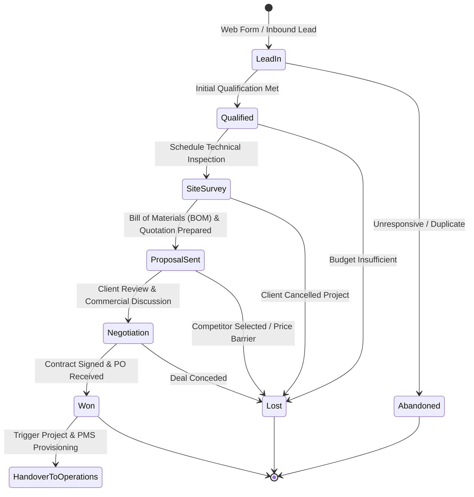
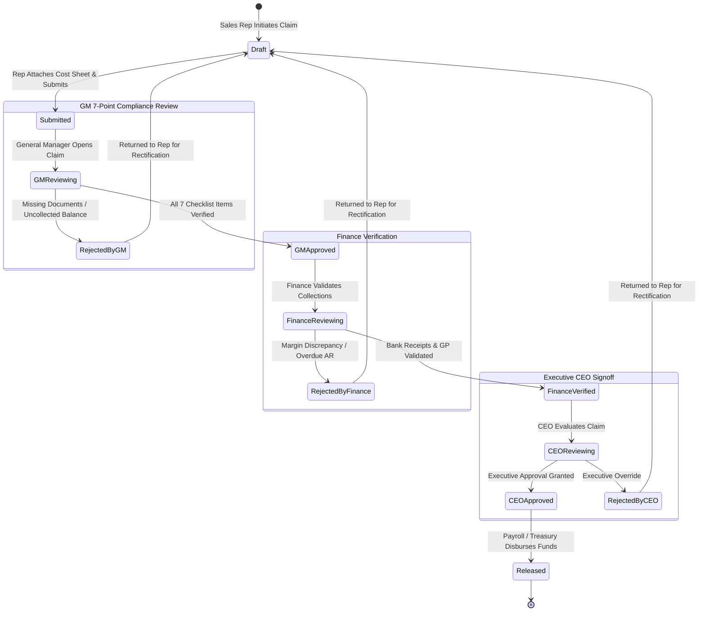
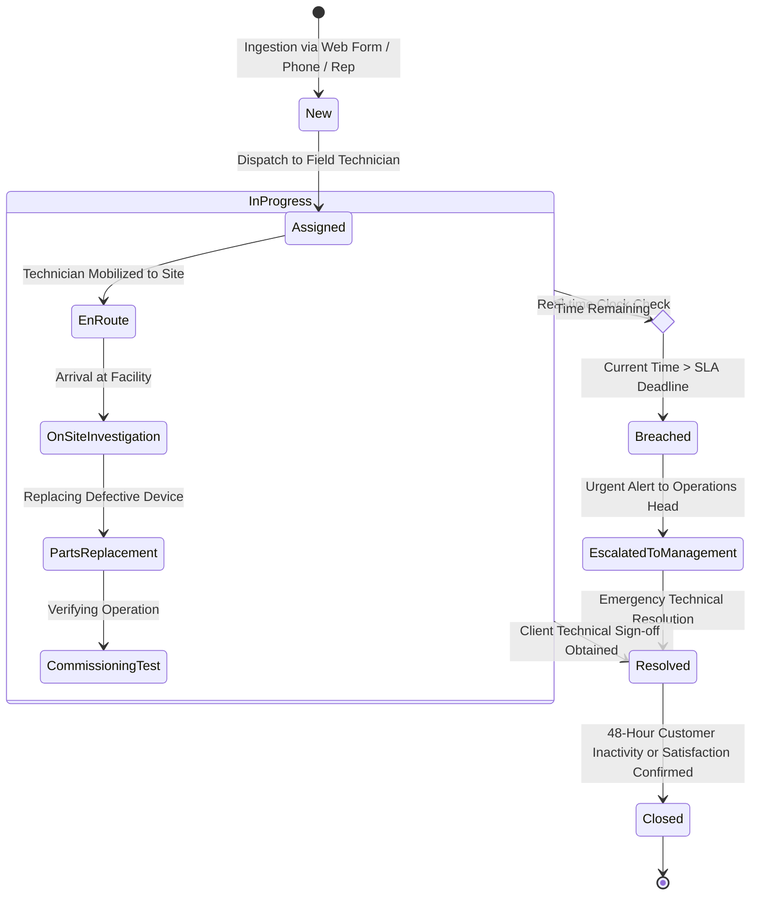
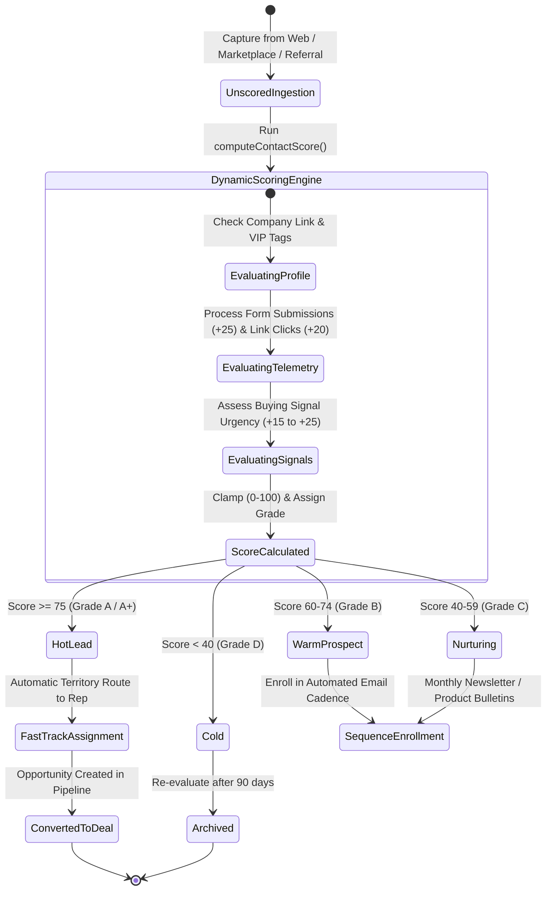
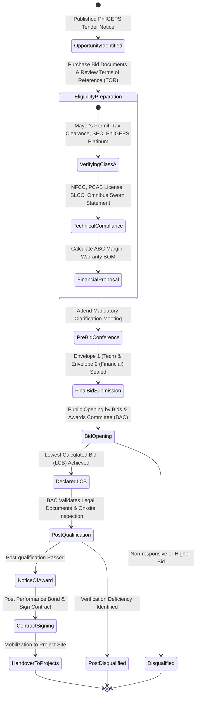

# AA2000 Connect — State Transition Models & Lifecycle Workflows

## 1. Overview

This document defines the formal State Transition Diagrams (finite state machines) governing the core lifecycle flows within **AA2000 Connect (CRM)**.

---

## 2. Deal & Pipeline State Transition Diagram

Tracks an enterprise commercial opportunity from initial site survey inquiry to contract closing.

---

## 3. 4-Tier Incentive & Commission Approval State Machine

Governs sales commission disbursements with strict multi-echelon separation of duties.

---

## 4. Service Request (Ticket) & SLA Lifecycle

Governs warranty tickets, equipment failures, emergency fire panel callouts, and technician resolution.

---

## 5. Lead Ingestion & Algorithmic Scoring Lifecycle

Illustrates lead state transitions as telemetry and algorithmic scoring engines update prospect temperature.

---

## 6. PhilGEPS Public Bidding State Machine

Compliant with Republic Act 9184 (Philippine Government Procurement Reform Act).

