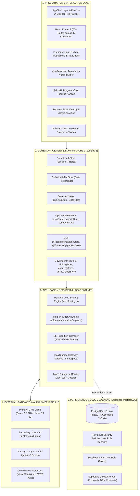
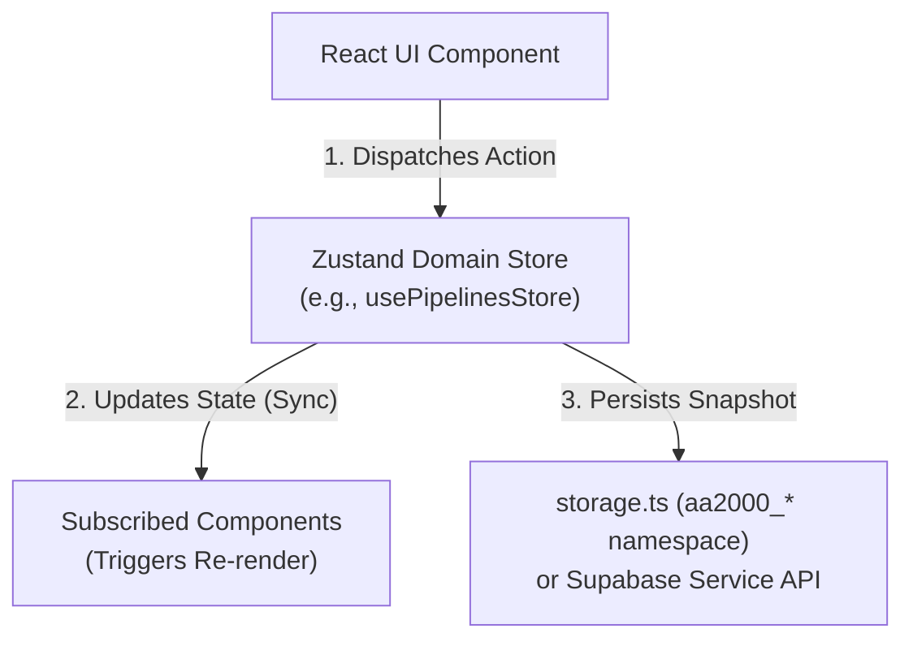
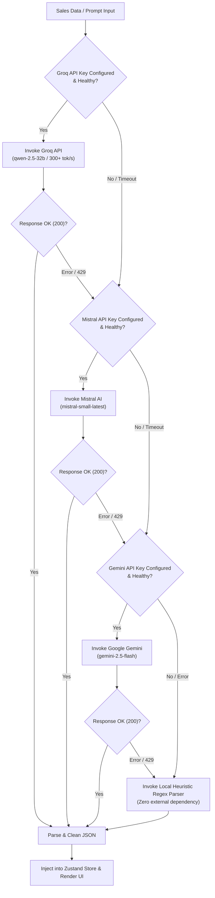
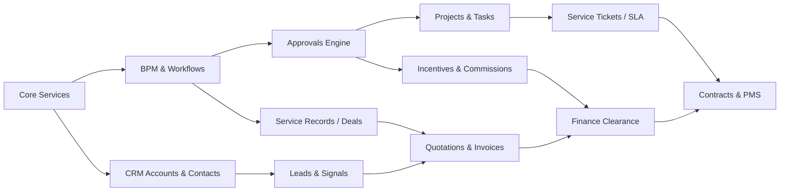
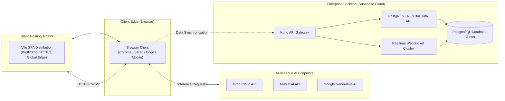

# AA2000 Connect — System Architecture Blueprint

## 1. Architectural Principles & System Goals

**AA2000 Connect (CRM)** is designed as an enterprise-grade, high-performance Business Operating System (BOS) tailored for commercial security, fire safety, and systems integration in the Philippines.

### Core Architecture Tenets
1. **Local-First, Zero-Latency Runtime**: The application operates with instant responsiveness using Zustand state stores synchronized to isolated local storage namespaces (`aa2000_*`), ensuring uninterrupted sales operations even during internet disconnections on job sites.
2. **Seamless Backend Transition**: A fully typed Supabase API layer (`src/services/supabaseService.ts`) mirroring 44 relational database tables allows straightforward cutover from browser persistence to enterprise PostgreSQL with Row-Level Security (RLS).
3. **Resilient Multi-Cloud AI Cascade**: Natural language parsing, next-best-action recommendations, and buying signal analysis are powered by a three-tiered fallback cloud AI pipeline (Groq $\rightarrow$ Mistral $\rightarrow$ Google Gemini $\rightarrow$ Local Heuristic Engine).
4. **Strict Role-Based Governance (RBAC)**: Enterprise separation of duties is enforced across 7 distinct roles, securing financial margins, audit histories, executive incentive releases, and IT credentials.
5. **Philippine Regulatory Compliance**: Native adherence to Republic Act 10173 (Data Privacy Act of 2012), Bureau of Fire Protection (BFP) standard codes, and Republic Act 9184 (Government Procurement Reform Act for PhilGEPS bidding).

---

## 2. High-Level Layered Architecture

---

## 3. Component & State Architecture

### 3.1 Store Pattern Architecture
Every domain store follows a unified, deterministic reactive pattern:
* **Immediate Local Mutation**: State updates are committed synchronously into Zustand, updating React components with zero layout flicker.
* **Synchronous Persistence**: State snapshots are serialized into `storage.ts` using namespaced keys (`aa2000_module_*`).
* **Cross-Store Reactions**: Coordinated actions (e.g. `formsStore.addSubmission` $\rightarrow$ `leadsStore.addLead`) invoke target store dispatches cleanly without cyclical dependencies.

---

## 4. Multi-Cloud AI Architecture & Fallback Cascade

To ensure 99.99% availability of conversational recommendations and NLP automation builders, the system executes an automated fallback cascade:

---

## 5. Security & Access Control (RBAC) Matrix

### 5.1 Role Hierarchy & Module Access Table

| Navigation Group / Feature Module | Super Admin | Admin | Sales Manager (GM) | Sales Rep | Finance Officer | Team Leader (Ops) | CEO / Exec |
|---|:---:|:---:|:---:|:---:|:---:|:---:|:---:|
| **Dashboard & Sales Pipeline** | ✅ | ✅ | ✅ | ✅ | ❌ | ✅ | ✅ |
| **Contacts & Companies** | ✅ | ✅ | ✅ | ✅ | ❌ | ✅ | ✅ |
| **Incentives Submission** | ✅ | ✅ | ✅ | ✅ | ❌ | ❌ | ❌ |
| **Incentives GM Approval (7-Point)**| ✅ | ✅ | ✅ | ❌ | ❌ | ✅ | ❌ |
| **Incentives Finance Review** | ✅ | ✅ | ❌ | ❌ | ✅ | ❌ | ❌ |
| **Incentives Executive Signoff** | ✅ | ❌ | ❌ | ❌ | ❌ | ❌ | ✅ |
| **Marketing & Email Campaigns** | ✅ | ✅ | ✅ | ✅ | ❌ | ❌ | ❌ |
| **Visual Workflow Builder** | ✅ | ✅ | ✅ | ❌ | ❌ | ❌ | ❌ |
| **AI Agents & Model Switcher** | ✅ | ✅ | ✅ | ❌ | ❌ | ❌ | ❌ |
| **Lead Capture & Ingestion** | ✅ | ✅ | ✅ | ✅ | ❌ | ✅ | ✅ |
| **Lead Territory Assignment** | ✅ | ✅ | ✅ | ❌ | ❌ | ❌ | ❌ |
| **Service Tickets & SLA** | ✅ | ✅ | ✅ | ✅ | ❌ | ✅ | ✅ |
| **Projects & Installation Tasks** | ✅ | ✅ | ✅ | ✅ | ❌ | ✅ | ✅ |
| **PhilGEPS Bidding Management** | ✅ | ✅ | ✅ | ❌ | ❌ | ❌ | ✅ |
| **KPI Scorecard & Reports** | ✅ | ✅ | ✅ | ❌ | ✅ | ✅ | ✅ |
| **Contracts & Maintenance (PMS/CMS)**| ✅ | ✅ | ✅ | ❌ | ✅ | ✅ | ✅ |
| **Admin Panel & Branding** | ✅ | ✅ | ❌ | ❌ | ❌ | ❌ | ❌ |
| **Audit Logs & Security Telemetry** | ✅ | ✅ | ❌ | ❌ | ❌ | ❌ | ❌ |

---

## 6. Database Schema & Migration Blueprint

The platform's relational backend is implemented in `supabase/migrations/001_full_schema.sql` comprising 44 tables across 27 domain modules:

### Row Level Security (RLS) Rules
* `service_records`: Accessible only to the assigned employee or administrators (`assigned_to = auth.uid() OR role = 'admin'`).
* `contacts` & `leads`: Sales reps can view only accounts assigned to them, while Sales Managers and Admins possess visibility across the complete territorial hierarchy.
* `app_requests`: Tech leads view assigned service tickets; emergency breach alerts broadcast across managerial roles.
* `projects`: Accessible to project team members matching `auth.uid() = ANY(team_members)`.

---

## 7. Deployment & Operational Topology

